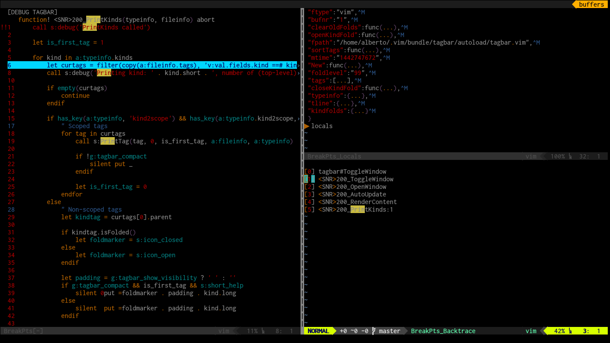

# vim-breakpts

Visual debbuging on vim

## Install 

Use [Vundle](https://github.com/VundleVim/Vundle.vim)

    Plugin vim-scripts/genutils
    Plugin albfan/vim-breakpts

## Usage

For sophisticated plugins, normally command line debugging or tracing is not enough.

You can use [vim-breakpts](https://github.com/albfan/vim-breakpts) to do a visual debug inside vim.

It is based on remote debugging, so you need to debug a server instance of vim.

Basically:

Terminal 1:

    $ vim --servername Foo
    ...
    set breakpoint on any Foo function
    do whatever operation which trigger Foo logic
    ...

Terminal 2:

    $ vim
    :BreakPts
    :BPRemoteServ FOO
    :BPDWhere or F7 (locate actual debug execution point)
    :BPDNext or F12 (next execution line)
    :BPDStep or F11 (step inside functions, dictionary functions)
    :BPDEvaluate or F8 (evaluate word under cursor, if pressed on visual selection evaluates selection)
    :BPDCont or F5 (continue execution)

See some plugins are loaded dynamically so you need to operate with them prior to set breakpoints.

Once loaded you can set breakpoints from connected vim with:

    :BPFunctions (Show debuggeable fuctions on RemoteServer)
    :BPScripts (Show debuggeable scripts on RemoteServer)
    :BPPoints (Show defined breakpoints on RemoteServer)

Once on debugging you can use:

    :BPDLocals (Variables and arguments to functions)
    :BPDBacktrace (Call stack to debugging point)

I have fix/tweak/evolve a lot of vim plugins thanks to this great plugin.

## Requirements

- Vim 7.0 is minimum version required.
- [genutils](https://github.com/vim-scripts/genutils)
- Plugin no longer depends on multvals.vim

## Background

vim-breakpts is based on a [hacky trick documented](https://github.com/vim/vim/blob/master/runtime/doc/eval.txt#L8127)

>A practical example:  The following command ":LineNumber" displays the line
>number in the script or function where it has been used: >
>
>    :function! LineNumber()
>    :    return substitute(v:throwpoint, '.*\D\(\d\+\).*', '\1', "")
>    :endfunction
>    :command! LineNumber try | throw "" | catch | echo LineNumber() | endtry

## Features

The plugin provides a few features for debugging Vim scripts that are similar to what IDEs normally have, such as browing source, managing breatpoints etc.  Setting breakpoints visually in functions is very important as you need to specify the exact line number for the line you are interested in (which often is difficult to find out if you use |line-continuation| characters to format code). This also avoids typing in the |:breakadd| command while guessing what the scriptids for your script are. It also defines a few convenience commands that take the place of Vim built-in commands and add Vim command-line completion feature.

The plugin also provided utilties to create various conditional breakpoints programmatically to help debug complex and iterative logic. You can set a condition, a skip count and an expire count for your breakpoint to be valid on any particular line.

You can also simply use the plugin to browse Vim sripts and functions. It provides a browser history type of features to drill into the code, by navigating the function calls and return back to the previous function at any time.

Here is a list of features:

 - Set/unset breakpoints in functions and scripts visually.
 - Save/clear/restore list of breakpoints across sessions.
 - Browse functions and script by navigating through the list of functions (and function references) and scripts.
 - Reload scripts when they change externally (during development)
 - Global functions to set/unset breakpoints programmatically with optional conditions.
 - Misc. alternative commands for the built-ins that typically work better (better completion and defaults).
 - Remote debugging ability to debug scripts in one Vim session using another Vim as the debugger.

## Credits

This is a fork of http://www.vim.org/scripts/script.php?script_id=618 created by Hari Krishna Dara

